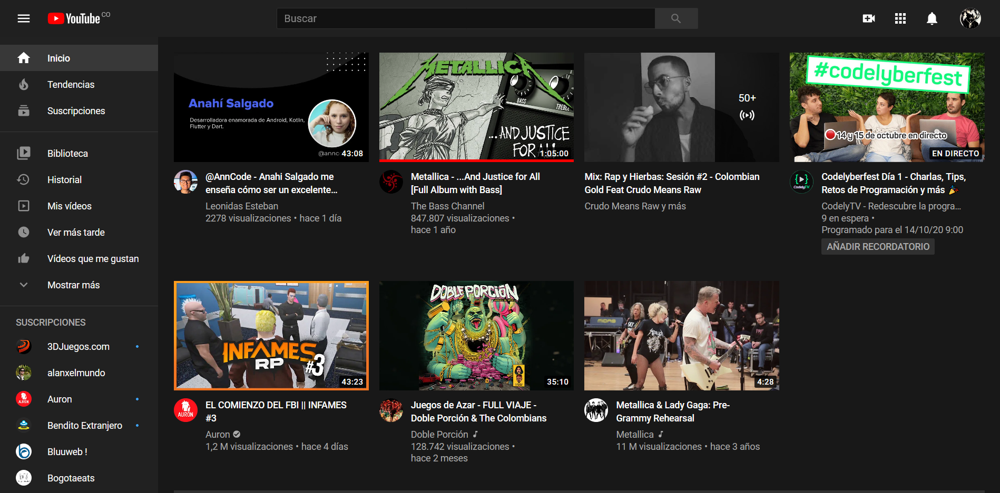

# Proyecto Interfaz Gráfica en Java

En este proyecto se llevará a cabo el desarrollo de una interfaz gráfica en Java, con el curso de Interfaz Gráfica en Java dictado por la Semana de Ingenio y Diseño (SID) de la Universidad Distrital.

## Objetivo

El objetivo del proyecto es replicar la interfaz de Home de Youtube en el lenguaje Java sin el uso de asistente gráfico, es decir, con código puro. El resultado esperado es el siguiente.

## Resultados

<h3>
    En este apartado se van a mostrar los adelantos realizados progresivamente en el proyecto.
</h3>

Se añadieron estilos e imagenes de manera que la interfaz de inicio de sesión se vea mejor esteticamente. Lastimosamente, las imagenes pierden la calidad al ser añadidas a los paneles correspondientes.

Más adelante se harán mejoras.

## Autor

<h3>
    Daniel Fernando Moreno Cáceres  
    Código: 20151020063  
    Ingenería de Sistemas  
</h3>
